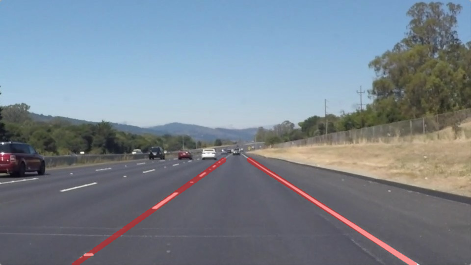

#**Finding Lane Lines on the Road** 

##Writeup - CarND Term 1 Project 1 

---

**Finding Lane Lines on the Road**

The goals / steps of this project are the following:
* Make a pipeline that finds lane lines on the road
* Reflect on your work in a written report

[//]: # (Image References)

[image1]: ./examples/grayscale.jpg "Grayscale"

---

### Reflection

###1. Describe your pipeline. As part of the description, explain how you modified the draw_lines() function.

My pipeline consisted of the following steps: 
* Converted the images to grayscale
* Used Gaussian smoothing to remove some of the noise
* Canny edge detection was used to outline the primary edges in the image
* Defined a 4-sided polygon to identify the area of interest
* A Hough transform was used to find segments along the lane lines

After the pipeline was developed, the line segments found with the Hough transform were extrapolated into one continuous line for the right and left lane lines using a weighted average.

The average line for right and left lane lines were then converted to two points, one point at each end of the 4-sided polygon border. The points could then be used in the cv2.line() function and then overlaid on the original image. This was the modification to the draw_lines() function in order to be able to draw one continuous line. 

This is an example of the images tested:

And the output after the lane lines were detected:

This same pipeline was then used for finding lane lines in video files. In addition, the challenge video was attempted with modified code that utilized a white and yellow color mask to find lane lines when objects and various road surfaces are in the image. 

###2. Identify potential shortcomings with your current pipeline

One potential shortcoming would be when bright objects or light coloring (similar to lane lines) appear in the center of the lane. This would cause segments to be found in areas where lane lines are not present and offset the average line calculation.

Another shortcoming could be curves in the road. Currently the lane line calculation only uses a straight line formula. Line formulas using polynomials (or other methods) would be needed to identify curves. I was not able to add this functionality to my submission for the challenge video but would like to see if using a best fit line could accomplish this.

###3. Suggest possible improvements to your pipeline

A possible improvement would be to have the parameters for the Hough transform and Canny edge detection be based off of the image brightness and contrast so they would adjust for darker or brighter images. In addition, it would benficial to structure the program in a way that you could loop through a range of parameters to easily find the optimal set up. 

Another potential improvement could be to have the 4-sided polygon used to identify the area of interest be automatically generated based on image size and potentially edge patterns.
